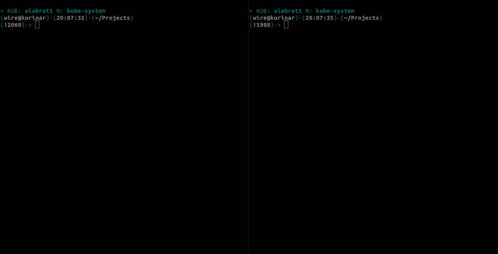

# kube-shell

Kubernetes shell bash functions to help working with multiple kubernetes clusters.

- switch between namespaces easily
- switch easily between clusters
- fork kubeconfig to work with multiple clusters / namespaces in separate shells
- send commands to multiple contexts at once with `krun`

## Demo

### Working on multiple contexts at once

Great for cluster operators, check your deployments across infrastructure or deploy changes to multiple contexts.


### Forking Kube Config in separate shell

Sometimes it's handy to have two contexts in two shells



There are also [Demos for basic functions](https://github.com/rvojcik/kube-shell/tree/main/img) like switching context, switching between last contexts and namespaces. 

## Installation

Add sourcing to your `.bash_rc` file like

```
source /path/to/kubeshell.sh
```

or directly from shell

```
bash# source ./kubeshell.sh  
```

## Usage

- `kcon`, change context, `--` or `-` for switching between last contexts
- `kname`, change namespace, `--` or `-` for switching between last namespaces
- `kfork`, fork kubeconfig to separate instance, can operate on different cluster in every shell, `del` for destroying fork and returning to main kubeconfig file
- `krun`, send commands to multiple contexts at once

### krun

For list contexts where commands will be send
```
krun
```

Add context to krun
```
krun + context_name
```

Remove context from krun
```
krun - context_name
```

You can also add or remove all contexts with `ALL`
```
krun + ALL
```

Get kube-system pods from contexts
```
krun get pods -n kube-sytem
```

